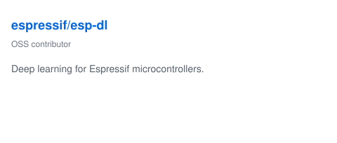
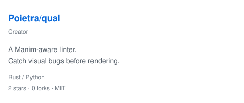

# Hi there 👋

I’m Takuya Kataiwa, an informatics student and researcher at Shizuoka University.

I explore where natural and formal languages meet, with a focus on safe and meaningful interaction between humans and AI. My interests include natural language processing, usable security, LLM security, and cognition.

Feel free to connect via one of the links below:

- [Portfolio](https://hosi121.github.io/portfolio/)
- [Researchmap](https://researchmap.jp/takuyakataiwa)

## GitHub Metrics

  
  

<table>
  <tr>
    <td width="50%" valign="top">
       
       
      
    </td>
    <td width="50%" valign="top">
      
    </td>
  </tr>
</table>
